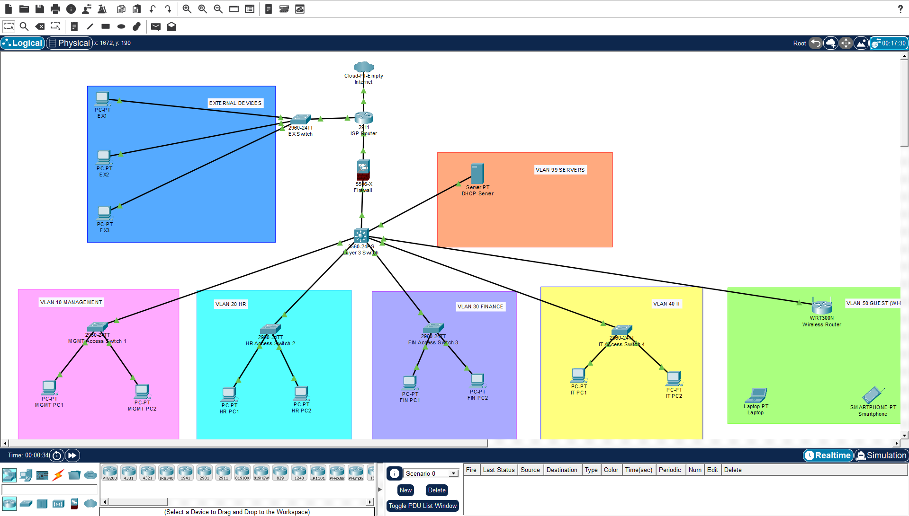
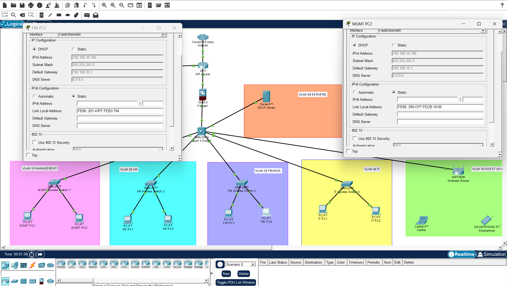
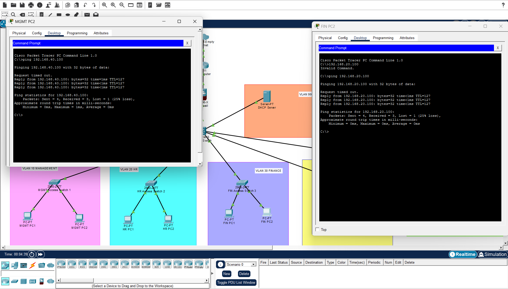
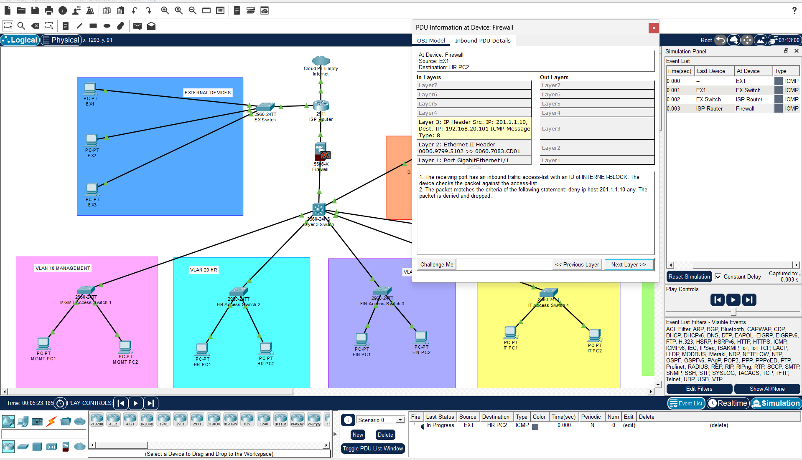

# Enterprise Network Design and Security Using Cisco Packet Tracer

## Overview

This project presents the design and implementation of a secure and scalable enterprise network using Cisco Packet Tracer. The network architecture simulates a real-world enterprise environment where multiple departments communicate efficiently while remaining logically separated through VLAN segmentation.

The solution incorporates Layer 3 switching, centralized DHCP services, inter-VLAN routing, firewall-based security, NAT/PAT, wireless connectivity, and access control mechanisms to demonstrate industry-standard enterprise networking practices.

---

## Project Objectives

The primary objectives of this project are:

* Design a secure enterprise network architecture.
* Implement VLAN-based network segmentation.
* Configure Inter-VLAN Routing using a Layer 3 Switch.
* Deploy a centralized DHCP Server for dynamic IP address allocation.
* Configure DHCP Relay (IP Helper Address) across VLANs.
* Secure the network using a Cisco ASA Firewall.
* Implement NAT/PAT for Internet connectivity.
* Restrict unauthorized access using Access Control Lists (ACLs).
* Provide enterprise wireless network access.
* Verify connectivity and communication across all departments.

---

## Network Architecture

### Logical Topology

```text
                    Internet
                        │
                     Cloud
                        │
                   ISP Router
                        │
                 Cisco ASA Firewall
                        │
               Layer 3 Core Switch
      ┌──────────┬──────────┬──────────┬──────────┬──────────┐
      │          │          │          │          │          │
   VLAN 10    VLAN 20    VLAN 30    VLAN 40    VLAN 50    VLAN 99
 Management      HR      Finance        IT     Wireless    Servers
```

---

## Network Components

| Device              | Function                          |
| ------------------- | --------------------------------- |
| Cloud               | Simulates Internet connectivity   |
| ISP Router          | Provides WAN connectivity         |
| Cisco ASA Firewall  | Network security and NAT/PAT      |
| Layer 3 Switch      | Inter-VLAN Routing                |
| Layer 2 Switches    | Departmental access switching     |
| DHCP Server         | Centralized IP address management |
| Wireless Router     | Wireless client access            |
| PCs                 | Department workstations           |
| Laptop & Smartphone | Wireless clients                  |
| ISP Switch          | External network simulation       |

---

## VLAN Design

| VLAN ID | Department             | Network Address |
| ------- | ---------------------- | --------------- |
| 10      | Management             | 192.168.10.0/24 |
| 20      | Human Resources        | 192.168.20.0/24 |
| 30      | Finance                | 192.168.30.0/24 |
| 40      | Information Technology | 192.168.40.0/24 |
| 50      | Wireless Network       | 192.168.50.0/24 |
| 99      | Server Network         | 192.168.99.0/24 |

---

## Key Features

### Network Segmentation

* VLAN-based departmental separation
* Improved security and traffic management
* Broadcast domain isolation

### Layer 3 Routing

* Inter-VLAN communication
* High-performance routing through Layer 3 switching

### DHCP Services

* Centralized DHCP server deployment
* Dynamic IP address allocation
* DHCP Relay (IP Helper Address) configuration

### Security Implementation

* Cisco ASA Firewall integration
* Access Control Lists (ACLs)
* External traffic filtering
* Enterprise security policy enforcement

### Internet Connectivity

* NAT/PAT implementation
* ISP network simulation
* Secure outbound Internet access

### Wireless Networking

* Dedicated Wireless VLAN
* Mobile device connectivity
* Enterprise wireless access support

---

## Repository Structure

```text
Enterprise-Network-Cisco-Packet-Tracer/
│
├── README.md
├── LICENSE
│
├── packet-tracer/
│   └── Enterprise_Network_Design.pkt
│
├── documentation/
│   ├── Enterprise_Network_Planning.pdf
│   ├── Configuration_Guide.pdf
│   ├── IP_Addressing_Table.pdf
│   └── Testing_Report.pdf
│
├── configurations/
│   ├── ISP_Router.txt
│   ├── ASA_Firewall.txt
│   ├── Layer3_Switch.txt
│   ├── Management_Switch.txt
│   ├── HR_Switch.txt
│   ├── Finance_Switch.txt
│   ├── IT_Switch.txt
│   ├── DHCP_Server.txt
│   └── Wireless_Router.txt
│
├── screenshots/
│   ├── Topology.png
│   ├── DHCP_Test.png
│   ├── InterVLAN_Ping.png
│   ├── Firewall_ACL.png
│   ├── NAT_Verification.png
│   └── Simulation_Mode.png
│
└── assets/
    └── Banner.png
```

---

## Technologies and Concepts Used

### Networking Technologies

* Cisco Packet Tracer 9.0.0
* Cisco IOS CLI
* Cisco ASA Firewall

### Networking Concepts

* VLAN Segmentation
* Inter-VLAN Routing
* Layer 3 Switching
* DHCP Server Deployment
* DHCP Relay Agent
* Static Routing
* Network Address Translation (NAT)
* Port Address Translation (PAT)
* Access Control Lists (ACLs)
* Enterprise Wireless Networking
* Firewall Security

---

## Verification and Testing

The following tests were successfully performed to validate the network implementation:

* DHCP Address Allocation Verification
* Inter-VLAN Communication Testing
* Internet Connectivity Testing
* NAT Translation Verification
* Firewall ACL Validation
* Wireless Network Connectivity Testing
* Cross-Department Communication Testing
* External Device Access Restriction Verification
* Internal Server Reachability Testing

---

## Learning Outcomes

This project provides hands-on experience with:

* Enterprise Network Design
* VLAN Planning and Deployment
* Layer 3 Switching and Routing
* DHCP Infrastructure Management
* Firewall Configuration and Security Policies
* NAT/PAT Implementation
* Wireless Network Deployment
* Network Troubleshooting and Validation
* Enterprise Infrastructure Management

---

## Screenshots

### Network Topology



### DHCP Address Allocation



### Inter-VLAN Communication



### Firewall ACL Verification



### NAT Verification


---

## Future Enhancements

Potential improvements for future versions include:

* Dynamic Routing Protocols (OSPF/EIGRP)
* Redundant Core Infrastructure
* High Availability Firewall Deployment
* VPN Connectivity
* Network Monitoring and Logging
* AAA Authentication Services
* Active Directory Integration
* Intrusion Detection and Prevention Systems (IDS/IPS)

---

## Author

**Guruchandhran M**

Network Engineer | Cybersecurity Enthusiast | Cisco Networking Projects

---

## License

This project is licensed under the MIT License. See the `LICENSE` file for more information.

---

## Support

If you found this project helpful, please consider giving the repository a **⭐ Star** on GitHub.

Contributions, suggestions, and feedback are always welcome.
